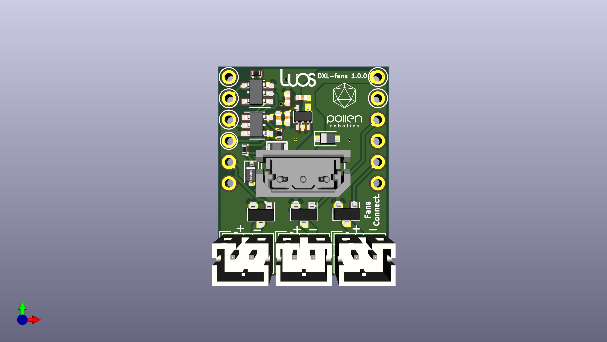

# dxl-fan-module
This repository contains the KiCad project of a custom Luos DXL Module with fans control for Reachy.

This is a DXL Luos module that can be seen here : https://github.com/Luos-io/Mod_dxl .
Three connectors for 12V fans have been added, controlled by the Luos microcontroller through transistors NMOSFET.
